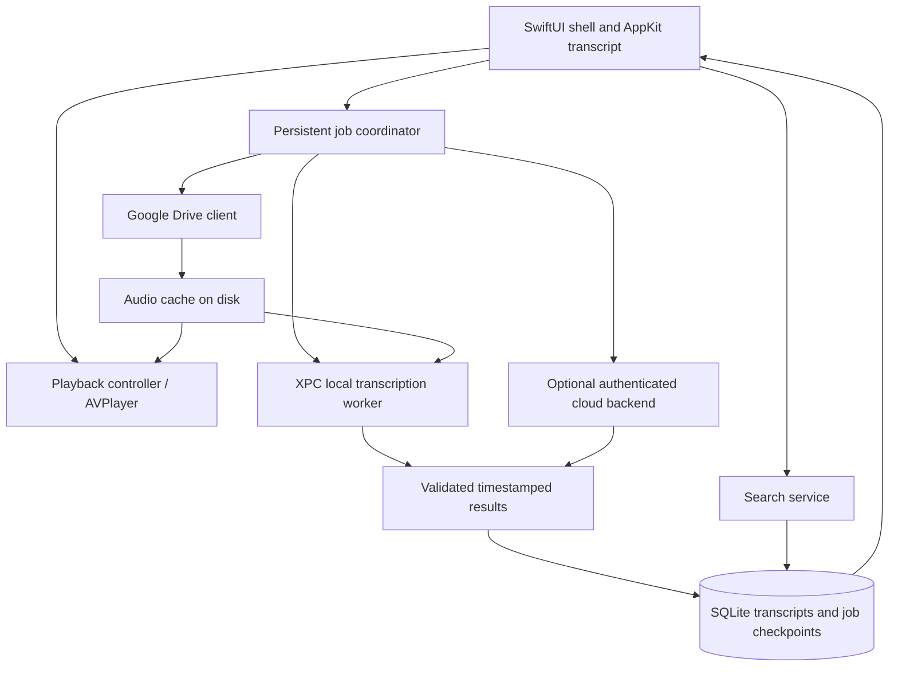

# Wordy implementation plan

Status: proposed architecture and delivery plan; implementation has not started.

## 1. Product objective

Build a native macOS application that connects to Google Drive, imports lecture recordings, transcribes them, and lets users listen while reading synchronized captions and a searchable transcript. Recordings of two hours or longer are a normal workload.

The audience is nontechnical. Installation, Google sign-in, model downloads, transcription, recovery, and updates must work through the graphical interface. Users must not need Terminal, Homebrew, Python, developer tools, or transcription-provider API keys.

Performance is a primary product requirement: transcription must not make playback, scrolling, searching, or navigation sluggish.

### Confirmed requirements

- Native execution on Intel Macs and Apple Silicon, including M1.
- One distributable app supporting both architectures.
- Google Drive audio import.
- Automatic creation of timestamped transcripts.
- Audio playback with synchronized captions and transcript highlighting.
- Transcript search with results that seek to the corresponding audio.
- Reliable handling of lectures lasting two hours or more.
- Local transcription by default, with optional cloud acceleration.
- Explicit user choice before sending lecture audio to a transcription provider; no automatic cloud fallback.

### Working assumptions

- Minimum deployment target: macOS 14, subject to the compatibility spike. Intel support means supported Intel hardware running the chosen minimum OS or later, not every Intel Mac ever sold.
- Initial Drive integration imports explicitly selected files. Automatic discovery within watched folders is a separate scope decision because it needs broader Google permissions.
- One Google account is sufficient for the first release.
- Initial supported input formats: MP3, M4A/AAC, WAV, and AIFF, with actual codec/container combinations verified in the prototype. Unsupported media gets a clear error.
- Lectures may use multiple languages. Confirm the priority languages before locking model defaults or search tokenization. Use multilingual models unless English-only use is established.
- Transcripts, listening state, and cached audio are stored locally. Cross-device transcript synchronization is outside the first release.
- Local processing pauses when the app quits or the Mac sleeps and resumes from persisted checkpoints when available again. An XPC service is not a promise of continuous processing after app exit.

## 2. Technology decisions

| Area | Choice | Rationale and boundary |
| --- | --- | --- |
| Language | Swift 6 | Native application development with explicit concurrency boundaries. |
| App shell | SwiftUI | Navigation, settings, dialogs, accessibility, and state-driven views. |
| Transcript surface | AppKit collection view embedded in SwiftUI | Reusable visible rows and controlled incremental updates for long transcripts. Validate selection and accessibility before committing the view implementation. |
| Playback | AVFoundation `AVPlayer` | Playback, time observation, seeking, and speed controls. |
| Audio preparation | `AVAssetReader` / `AVAudioConverter` | Incremental decoding and conversion to the transcription engine's required format. |
| Local inference | Pinned `whisper.cpp` release | Shared engine across Intel and Apple Silicon; Metal on supported Apple Silicon and a tested CPU path for Intel. |
| Process isolation | Bundled XPC transcription service | Keep model lifetime and inference failures outside the UI process. |
| Database | SQLite with GRDB and FTS5 | Transactions, migrations, indexed search, and durable job state. |
| Networking | `URLSession`, Google Drive API v3 | Typed API integration and downloads to disk. |
| Authentication | Maintained native OAuth library, PKCE, Keychain | Browser-based Google authorization; credentials stay out of ordinary app storage and logs. Validate the exact client and redirect configuration in the integration spike. |
| Cloud candidate | Deepgram Nova-3 through an app-owned backend | Timestamped output; subject to language, accuracy, latency, retention, and cost evaluation. |
| App updates | Sparkle 2 | In-app updates for direct distribution. |
| Build | Xcode, Swift Package Manager, reproducible C/C++ build | Universal app and worker with pinned dependencies. |
| Distribution | Developer ID signing, hardened runtime, notarized DMG | Familiar installation without command-line setup. |

Keep the application architecture native and small. Add another runtime, media library, or inference engine only when a demonstrated requirement justifies its packaging and maintenance cost.

The current baseline is `whisper.cpp`, not a claim that one model is fastest on every Mac. The first milestone must measure the proposed backend on real target hardware. A newer native transcription backend may be evaluated later behind the same interface if it provides a measured benefit without removing Intel support.

## 3. User experience

### First launch

1. Explain that transcription runs on the Mac by default.
2. Offer Google Drive connection and local file import.
3. Open Google's supported authorization flow and return to the app after sign-in.
4. Offer the recommended local speech model with download size and progress. Verify its integrity before marking it ready.
5. Let users select recordings and start transcription without configuring technical settings.

### Main window

- Sidebar: library, processing queue, and connection status.
- Library: title, duration, transcription status, and last listened position.
- Main area: timestamped, selectable transcript passages; current passage highlighted.
- Caption area: short readable text corresponding to the current playback time.
- Persistent player: play/pause, seek bar, elapsed/remaining time, skip controls, speed, and volume.
- Search: current lecture by default, with a library-wide mode and timestamped result snippets.
- Follow playback: enabled initially; manual scrolling suspends following until the user re-enables it.

Users can listen to cached audio while later portions are still being transcribed. Unprocessed regions remain visibly pending. Searching a partial transcript must state that only completed portions are included.

Phrase-level captions are the first release requirement. Word-by-word highlighting is conditional on measured timestamp quality. Searching should work independently of whether word-level timing is available.

### Recovery and accessibility

- Restore playback position and speed after reopening a lecture.
- Provide pause, resume, cancel, and retry actions for jobs.
- Translate common failures into useful actions: reconnect Google, free disk space, retry download, or choose a supported recording.
- Support VoiceOver, keyboard navigation, selectable/copyable text, scalable typography, and reduced motion.
- Export TXT, SRT, and VTT through native save dialogs.

## 4. Architecture and ownership



### Concurrency rules

- Main-actor work is limited to UI state and presentation.
- Decoding, inference, database queries, downloads, and indexing run outside the main actor.
- Run blocking C/C++ inference on a dedicated execution context in the XPC process; merely wrapping it in an async function does not make it nonblocking.
- Begin with one active local inference job. Bound downloads separately and tune using measurements.
- Give playback and interactive operations priority. Account for thermal pressure and memory pressure before increasing throughput.
- Keep SQLite writes coordinated by the application. The worker returns bounded result batches and does not independently mutate the app database.
- Pass validated file references and bounded messages across XPC rather than entire recordings or model data. If sandboxing is enabled, validate file access and entitlements in the first milestone.

### Provider interface

Both engines implement a common transcription interface with capabilities, model/version identity, language, progress, cancellation, and timestamped results. Do not force cloud job lifecycle semantics into local chunk semantics.

Normalize results into absolute source-audio times. Include start/end time, text, sequence, finalization status, and optional word timings. Provider confidence values are optional and must not be presented as interchangeable calibrated accuracy scores.

## 5. Long-recording pipeline

1. Read Drive metadata, confirm download capability, and record source identity and version information.
2. Download to a temporary file on disk. Publish it to the cache only after successful validation. Recover interrupted downloads with range requests where supported; restart if source version or range behavior makes recovery unsafe.
3. Inspect duration, codec, channels, and sample rate without loading the complete recording.
4. Decode bounded windows and resample as required by the engine. Keep the original recording for playback.
5. Detect speech regions where useful, retaining a mapping to the original timeline. Skipping silence must never compress caption time.
6. Start by evaluating 30–60-second application chunks with overlap. These are scheduling/checkpoint units, not a change to the model's internal context limit. Benchmark against longer sequential processing before fixing chunk size.
7. Carry limited context where supported and reconcile overlapping words at boundaries. Verify that deduplication does not delete legitimate repeated speech.
8. Validate monotonic timestamps, clamp only explainable boundary errors, and flag malformed output for retry or review.
9. Commit completed segments, search-index updates, and the corresponding checkpoint together.
10. Publish incremental transcript updates without rebuilding the entire transcript view.
11. Mark the transcript complete only after all expected chunks and boundary reconciliation are committed.

Bound decoded buffers, queued chunks, and pending UI updates. Peak buffering should not grow linearly with recording duration. Model memory must be measured separately from the UI process and audio buffers.

Handle long silence, repeated phrases, music, applause, noisy speech, and abrupt file endings. Avoid inventing text for nonspeech regions; evaluate voice detection and engine suppression settings on real samples.

### Models

- Benchmark multilingual Whisper `small` as the balanced candidate and `base` as an older-Intel speed candidate.
- Evaluate a larger model for an optional quality setting only after memory and sustained latency measurements.
- Benchmark quantized variants before adopting them; verify quality as well as speed.
- Automatically select a recommended configuration based on supported hardware and measured capability, with simple user-facing speed/quality settings.
- Keep model versions stable within a job. Persist engine, model, and configuration identity for reproducibility.
- Resume model downloads safely, verify a trusted manifest/checksum, and atomically activate completed assets.
- Unload unused models after an appropriate idle interval or memory-pressure signal.

## 6. Playback, captions, and search

Use the player's media time as the source of truth. Do not advance a separate wall-clock counter for captions. Observe playback time and seeks, binary-search the ordered caption intervals, and update presentation only when the active interval changes.

Define captions as half-open intervals so adjacent cues do not compete at boundaries. Clear captions in gaps. Validate pause/resume, repeated seeks, variable playback speed, and end-of-file behavior. Remove player observers when their owner is released.

Store transcript passages as stable records. Render visible passages and a small surrounding window, preserve scroll position when new results arrive, and avoid emitting a full transcript string on every player tick.

FTS5 supplies indexed keyword, phrase, and prefix search. Treat user input as text unless an explicit advanced-search mode is introduced; use bound queries and safe FTS expression construction. Support case/diacritic handling appropriate to target languages.

Maintain a mapping from indexed passages to caption/source intervals. Account for phrases spanning caption or processing boundaries, for example by indexing larger contiguous passages or using controlled overlap with deduplicated results. A hit seeks to the containing passage when word timing is unavailable.

Debounce typing briefly, cancel superseded queries, and page library-wide results. Validate tokenization on required languages; a default tokenizer is not a universal multilingual solution. Semantic search and a vector database are outside the first release.

## 7. Persistence and cache

Proposed entities:

| Entity | Key information |
| --- | --- |
| Account | Internal identifier, provider account reference, connection state; secrets remain in Keychain. |
| Lecture | Stable ID, source account/file ID, source version/fingerprint, title, duration, format, cache state. |
| Transcript | Lecture and source version, provider/model/configuration, language, status, timestamps. |
| Segment | Transcript ID, order, absolute start/end time, text, finalization state, optional word timing. |
| Search passage | Transcript ID, indexed text, mapping to segment/time ranges. |
| Job | Provider, lifecycle state, retry metadata, progress, checkpoint, idempotency identity. |
| Chunk | Job, source time range, state, attempts, committed result reference. |
| Playback state | Lecture ID, position, speed, last opened time. |
| Model asset | Model/version, local path, integrity metadata, download/activation state. |

Use migrations, foreign keys, and transactional index maintenance. Ensure interrupted migration or job recovery cannot produce a falsely complete transcript.

Store managed audio and model assets in application-managed directories. Keep temporary downloads distinguishable from valid cache entries. Cache eviction may remove re-downloadable audio, but must preserve transcripts and listening state. Let users pin offline audio and inspect storage usage.

A source change creates a new transcript generation; it must not attach old captions to changed audio. A removed or inaccessible Drive file should not erase an existing local transcript automatically.

## 8. Google Drive integration

### Initial import

Use Google Picker with `drive.file` for user-selected lectures. Google documents a browser-based desktop Picker integration; validate its return flow, client configuration, and any hosted component in a small prototype before polishing the UI.

Use the system-supported browser authorization flow, PKCE, state validation, and the redirect method appropriate to the selected Google client type. Do not put Google authorization in an embedded web view. Handle token refresh, revoked consent, account changes, and Workspace policy restrictions.

The developer supplies the Google Cloud project, OAuth configuration, privacy policy, and any required verification. Users only connect their account.

### Optional watched folders

Automatic discovery of arbitrary files requires a separate permission design, likely `drive.readonly`, which Google classifies as restricted. Selecting a folder under `drive.file` must not be assumed to grant recursive access to its contents.

If included, implement initial folder enumeration followed by persisted change tracking, pagination, retries/backoff, and reconciliation after expired change tokens. Decide whether shared drives and shortcuts are supported before promising them. Poll/reconcile while the app is running; continuous monitoring after quit would require an additional background or server design.

Start Google verification early if broad access is required. Restricted-scope verification and any applicable assessment depend on the final data handling; confirm current requirements before release.

## 9. Optional cloud acceleration

Cloud mode is an explicit action per lecture or batch. Explain the receiving service, applicable charge or allowance, and relevant data handling before upload. Do not silently upload when local processing is slow or fails.

The initial provider candidate is Deepgram Nova-3. Select it only after a comparison on representative lectures that measures recognition quality, timestamp quality, end-to-end latency including transfer, language coverage, and cost.

Proposed backend: a small TypeScript service on a managed platform, managed PostgreSQL for durable job/usage records, a managed queue for processing, and private object storage only where needed for transfer. Choose deployment provider and region after retention, cost, and audience location are decided. No backend is needed for the local-only workflow.

- Authenticate app users without asking them for provider API keys. Google Drive credentials are not generic backend authentication credentials.
- Keep provider secrets server-side. Avoid sending Drive refresh tokens to the transcription backend; upload only the explicitly selected recording or prepared audio.
- Enforce authorized job ownership, quotas, request size/duration limits, and retry/idempotency behavior.
- Verify provider upload limits and timeout behavior. Use asynchronous jobs and durable status where appropriate for long recordings.
- If cloud chunking is necessary, preserve source offsets and reconcile boundaries just as for local results.
- Persist server job IDs locally so reopening the app can retrieve results without submitting duplicate billable work.
- Define cancellation honestly: stopping the UI request may not cancel an accepted provider job or its charge.
- Verify actual provider retention/deletion controls before displaying promises. Expire temporary backend objects and provide user-visible deletion behavior.
- Return the same normalized transcript schema used by local processing.

Pricing, account/payment flow, operating budget, and final retention policy remain product decisions. The architecture must support an app-managed allowance or billing without technical setup by users.

## 10. Performance and quality acceptance

These are initial engineering targets, not existing measurements or guaranteed transcription speeds. Refine them using the baseline prototype and document any accepted change.

| Measurement | Initial target and conditions |
| --- | --- |
| Cached playback start | p95 below 250 ms, measured from click to audible playback on supported formats. |
| Cached search-to-seek | p95 below 200 ms from result activation to playback at the target. |
| Current-lecture search | p95 below 100 ms from submitted query to available results; report typing debounce separately. |
| Library search | p95 below 200 ms on a defined 1,000-lecture corpus, paginated results. |
| Transcript interaction | Smooth 60 Hz scrolling on a 60 Hz display while inference runs; inspect frame hitches. |
| Duration scaling | Bounded audio buffering and no unexplained increase in working memory from 2-hour to 4-hour inputs with the same model. |
| Recovery | At most the active uncommitted local chunk is recomputed; committed results are not duplicated. |
| Caption correctness | No cumulative drift introduced by chunking, silence removal, seeking, or speed changes. Measure model timing error separately. |

Test on an 8 GB M1 Mac and an identified Intel Mac that meets the minimum deployment target. Rosetta runs are supplementary and do not substitute for Intel performance tests. Include cold/warm runs, concurrent playback, and sustained workloads long enough to expose thermal throttling.

Measure real-time factor (processing seconds divided by audio seconds), first usable transcript latency, peak total memory across app/worker/GPU where measurable, model load time, and energy/thermal behavior. Set numerical transcription-speed and accuracy gates after the baseline rather than inventing a two-hour completion promise.

Build a small evaluation set with consented recordings: clean lecture, noisy room, technical vocabulary, accented speech, long silence, repeated phrases, and each priority language. Maintain human-reviewed excerpts for word error rate and timing evaluation. Test 2-hour and 4-hour recordings for lifecycle and memory behavior.

## 11. Delivery milestones

### Milestone 1: compatibility and performance proof

- Create the Xcode app, local media import, minimal player, and XPC worker.
- Compile the app, worker, and inference dependencies for `arm64` and `x86_64` with portable architecture settings.
- Run a full two-hour recording on physical M1 and Intel hardware.
- Compare candidate models and chunk policies; measure playback responsiveness, quality, time, and memory.
- Prototype incremental results and checkpoint/restart behavior.
- Validate signing/XPC resource access and the provisional minimum OS.

Exit: an evidence-backed engine/configuration recommendation and a functioning vertical slice on both architectures. Do not substitute a short demo for the long-file test.

### Milestone 2: complete local listening workflow

- Add database schema/migrations, durable job coordinator, cache, and model manager.
- Build library, virtualized transcript, caption synchronization, playback state, search, and exports.
- Add overlap reconciliation, safe incremental indexing, cancellation, retry, and restart recovery.
- Test pending transcript regions, search boundary matches, sleep/wake, and low-disk handling.

Exit: a user can import a two-hour local recording, transcribe, listen/read, search-to-seek, close, and resume without technical intervention.

### Milestone 3: Google Drive

- Implement OAuth, token storage/refresh, Picker integration, and selected-file imports.
- Add durable downloads, source-version handling, reconnection, and permission errors.
- Exercise interrupted transfers and changed/removed files.
- Include watched-folder discovery only if that scope is chosen; start required verification immediately.

Exit: a fresh user can connect Drive and complete the same listening workflow through the GUI.

### Milestone 4: cloud acceleration

- Evaluate the provider and settle retention, usage limits, and pricing presentation.
- Build authenticated backend job submission/status/results and secret management.
- Add explicit cloud selection, cost/allowance display, cancellation semantics, and resumed result retrieval.
- Test duplicate submission, network interruption, provider failure, and unauthorized access.

Exit: local and cloud transcripts use the same playback/search path, and cloud work is never initiated without an explicit user choice.

### Milestone 5: release hardening

- Complete accessibility, onboarding, storage controls, actionable errors, and updates.
- Profile against the performance corpus and fix measured bottlenecks.
- Add reproducible release automation, dependency/license inventory, and model attribution.
- Sign all nested components, notarize/staple the distribution, and validate update signatures.
- Test clean installation, first-run model download, Google sign-in, update, and migration on both architectures without developer tooling installed.

Exit: a signed release candidate meets the agreed functional and performance gates on the hardware matrix. Public distribution remains a distinct release action.

## 12. Verification strategy

- Unit/integration tests for timestamp mapping, overlap reconciliation, phrase boundaries, safe search queries, source-version invalidation, migrations, and atomic checkpoint/index commits.
- Provider contract tests with recorded fixtures for local/cloud result normalization; use deliberate opt-in live calls for billable provider checks.
- Failure injection for worker crash, application exit, corrupt download, disk exhaustion, expired credentials, and network loss.
- UI tests for onboarding, playback controls, search navigation, and recovery messages; manual accessibility checks where automation is insufficient.
- Performance checks using Instruments, signposts, and repeatable release-build benchmarks.
- Release checks for architecture slices, linkage, signatures, notarization, model assets, and update installation.

Do not add tests that merely repeat trivial presentation implementation. Protect the long-file, timing, recovery, privacy-choice, and distribution behaviors that define the product.

## 13. Repository shape after scaffolding

```text
Wordy.xcodeproj
App/                         # SwiftUI shell and application composition
Features/                    # Library, transcript, player, search, settings
Core/                        # Domain models and provider contracts
Services/                    # Drive, OAuth, jobs, cache, model management
Persistence/                 # GRDB records, migrations, full-text search
TranscriptionService/        # XPC worker and inference adapter
Vendor/                      # Pinned inference source/build integration
Tests/                       # Behavioral, integration, and UI checks
Benchmarks/                  # Harness and non-sensitive corpus metadata
Backend/                     # Added with cloud milestone
docs/                        # Architecture decisions and release procedures
```

This is a proposed layout, not a claim that these files or targets already exist. Keep private recordings, transcripts, model binaries, credentials, and generated build output out of version control.

## 14. Decisions to revisit with evidence

- Exact supported Intel model/OS matrix and deployment target.
- Priority languages and representative recordings.
- File selection versus automatic watched-folder discovery for the first release.
- Default model/quantization and transcription-speed gates for each hardware tier.
- Word highlighting quality threshold and whether alignment work is worthwhile.
- Cloud provider, region, retention, pricing, and account flow.
- Whether direct distribution alone is sufficient; Mac App Store distribution has a separate packaging/update path.

These do not block the local prototype. Record decisions and benchmark evidence as milestones progress.

## 15. Primary references

- [whisper.cpp capabilities, models, and timestamps](https://github.com/ggml-org/whisper.cpp)
- [Apple: universal macOS applications](https://developer.apple.com/documentation/apple-silicon/porting-your-macos-apps-to-apple-silicon)
- [Apple: AVPlayer time observation](https://developer.apple.com/documentation/avfoundation/avplayer/addperiodictimeobserver(forinterval:queue:using:))
- [SQLite FTS5](https://www.sqlite.org/fts5.html)
- [GRDB](https://github.com/groue/GRDB.swift)
- [Google Drive scopes](https://developers.google.com/workspace/drive/api/guides/api-specific-auth)
- [Google native-app OAuth](https://developers.google.com/identity/protocols/oauth2/native-app)
- [Google Picker for desktop apps](https://developers.google.com/workspace/drive/picker/guides/desktop-mobile-picker)
- [Google Drive downloads](https://developers.google.com/workspace/drive/api/guides/manage-downloads)
- [Deepgram prerecorded transcription](https://developers.deepgram.com/reference/speech-to-text/listen-pre-recorded)
- [Deepgram timestamps and utterances](https://deepgram.com/learn/working-with-timestamps-utterances-and-speaker-diarization-in-deepgram)
- [Apple notarization](https://developer.apple.com/documentation/security/notarizing-macos-software-before-distribution)
- [Sparkle sandbox integration](https://sparkle-project.org/documentation/sandboxing/)

Recheck dependency versions, provider capabilities, Google permission requirements, and Apple distribution requirements when implementing the corresponding milestone.
